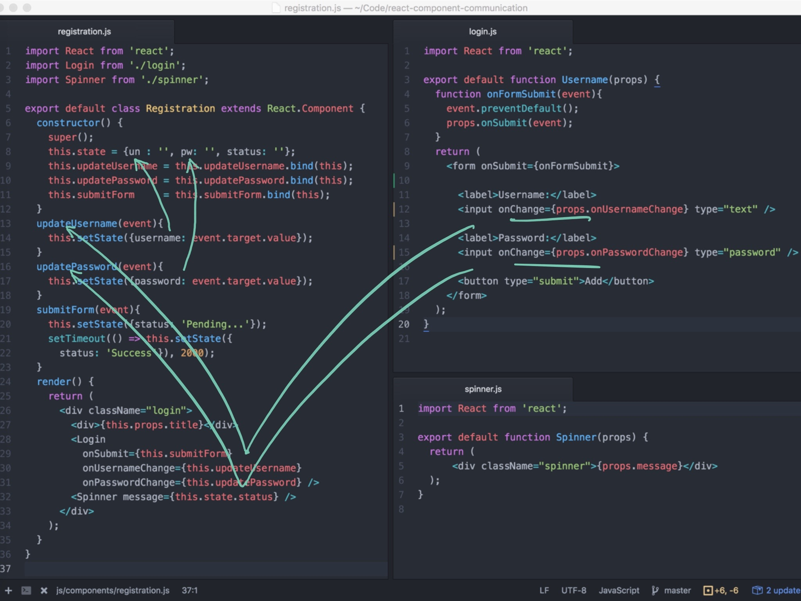
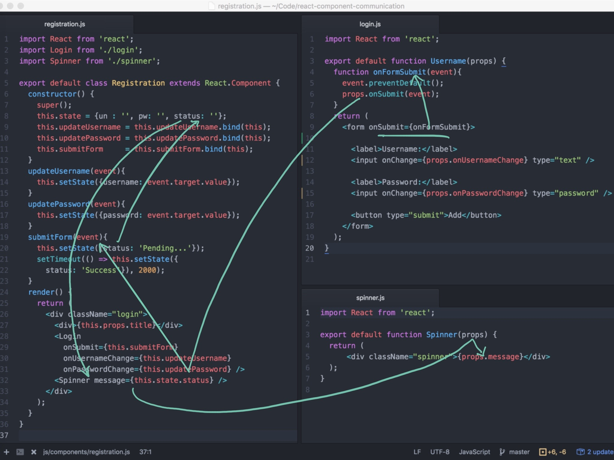

# Thinkful Component Communication

Parent passes values and event handlers to Child thru props

Child communicates to Parent using event handlers on props

Child communicates to Parent using event handlers which updates state which triggers prop update on Sibling

